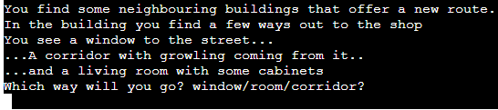

# Scavenge

Scavenge is a text adventure game. The player will be brought through a zombie survival story, where they must scavange for food to survive. Along the way they must use items and their intelegence to navigate safley through the dangers of the world they live in.

The game story is inspired by other zombie games that depend on the use of resources and weapons in order to survive. While younger players may not fit the target audience, older players may love the call back to orignal text games.

## How to Play

The game is mainly played via a simple Yes or No input from the user. More of the complexity to winning comes from the user's ability to use items and resources to reach the end. The decision weather or not to fight or retreat depending on their inventory.

The goal is to retrieve items from an abandonded store and return back to their home base. This gives the user a clear goal that stays in their head throughout the story.

When the game is first loaded the user will be presented with a short introduction to the world of the game. Then they will be asked weather or not they are ready to start the game. This will quickly give the user agency to start or not so they do not have to sit through a long screen each time. The user will be able to go down multiple branches through the game and can make the decision to take items and use them. However the items will have a durability so if they are used too often then they will eventually break and be unusable later in the game. This means the user has to make smart choices when given the option. By utilising these items and choices they will be able to win and make it back to survive.

## Flow Chart

## Features

### Branching Story Line

The game features a branching story line that can bring the user to different locations and endings depending on the users choice. To interact with these choices the user simply has to type in a single word, the selection of which is shown in the question. The game encourages the user to choose a playstyle and stick to it. The ending can be reached either by following the fully stealth (no weapon) branch or the weapon (full attack) branch. If the user tries to mix around too much they could end up with a gamer over state. However there is a secret ending which involves use of both playstyles and keeps the player weapon intact. The game ecourages replaying and experimenting with the different options. As there are 7 ways to reach a game over and 3 ways to reach a win state. That is 1 win for each playstyle and the secret mixed ending.

### Equipment

Depending on the play style of the user, certain equipment can be utilised for a game win. These items are to encourage a specific play style but to try and take both will get the user a game over eventually. The name is called using a dictionary as well as the equipped state. The game can use this to find out if a user has brought a certain item. Also depending on the user approach the user can bring the bat to the end of the game but they can also end up losing the bat. The durabilty goes down by 1 for each zombie killed. This adds more of a unique story depending on how many zombies the user kills.

### GAME OVER and You win!

The game will announce whenever the user hits a win or loss state. Both states are followed by some short story text to explain the state and then either GAME OVER or You Win! Will appear on screen. This clearly indicates to the user if they have won or lost the game and will then directly follow up with the play again function to get the user back to the beggining of the game. The text will also change colour further indicate to the user that GAME OVER is the bad ending and You Win is the good ending. 

### Play Again

Whenever the user reaches and end condition the game will run the play_again function. This will present the user with a yes or no question as to weather or not they want to try again. If yes is typed the user is successfully brought back to the beginning by running the game_intro function. This loops the user back to the beginning of the game. We also make sure to include dictonary updates to make sure the play again does not intefere with the default values of the dictonary. Similarly when the user types no, the game will display a short message and the programn stops as expected. If any other input is detected then the programn will tell the user an invalid input was detected and the question will be asked again.

## Testing

My game was tested using the [Flow Chart](##flow-chart) located earlier in the document.

## Technologies

Python

Github

Gitpod

Python Time module

LucidChart

Colorama

Gyazo GIF Capture

## Deployment

App was Deployed to Heroku using the following steps.

1. Go to [Heroku](https://dashboard.heroku.com/apps) and log in.
2. Select on Create new App
3. Give App a name such as "scavenge-textadventure"
4. Go to the settings and locate the Configure vars section
5. Add a port with the name PORT and the value of 8000
6. Locate the buildpacks section and add the Python and nodejs buildpacks in that order
7. Scroll up and locate the Deploy tab where settings was found.
8. Add Github as the deployement method and find the Git page for the project.
9. Select the branch and press Deploy Branch

## Credits

The code and the story for the game was created entirely by myself with learning from the Code Institute Python course material.

## Aknowledgements

Adding delay to code learnt from: https://realpython.com/python-sleep/

Using While loops to allow invalid inputs to return back to choice question from: https://stackoverflow.com/questions/12828771/how-to-go-back-to-first-if-statement-if-no-choices-are-valid

Using Try/Except in a While loop refined by reading: https://stackoverflow.com/questions/36437631/python-validation-of-an-integer-except-or-except-valueerror