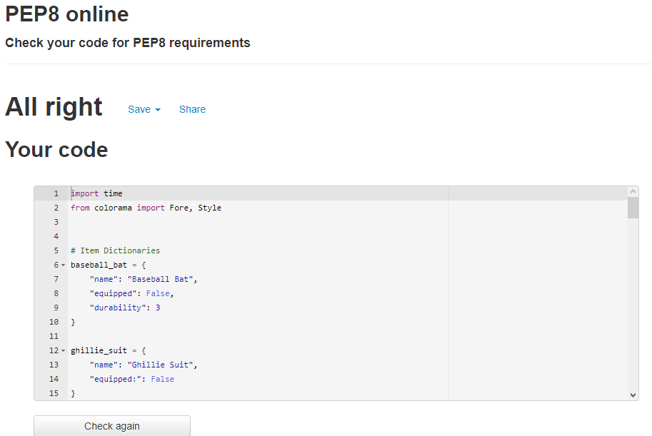

# Scavenge

Scavenge is a text adventure game. The player will be brought through a zombie survival story, where they must scavange for food to survive. Along the way they must use items and their intelegence to navigate safley through the dangers of the world they live in.

The game story is inspired by other zombie games that depend on the use of resources and weapons in order to survive. While younger players may not fit the target audience, older players may love the call back to orignal text games.

Final deployed version of my game is available [here](https://scavenge-textgame.herokuapp.com)

## How to Play

The game is mainly played via a simple Yes or No input from the user. More of the complexity to winning comes from the user's ability to use items and resources to reach the end. The decision weather or not to fight or retreat depending on their inventory.

The goal is to retrieve items from an abandonded store and return back to their home base. This gives the user a clear goal that stays in their head throughout the story.

When the game is first loaded the user will be presented with a short introduction to the world of the game. Then they will be asked weather or not they are ready to start the game. This will quickly give the user agency to start or not so they do not have to sit through a long screen each time. The user will be able to go down multiple branches through the game and can make the decision to take items and use them. However the items will have a durability so if they are used too often then they will eventually break and be unusable later in the game. This means the user has to make smart choices when given the option. By utilising these items and choices they will be able to win and make it back to survive.

## Flow Chart

## Features

### Branching Story Line

The game features a branching story line that can bring the user to different locations and endings depending on the users choice. To interact with these choices the user simply has to type in a single word, the selection of which is shown in the question. The game encourages the user to choose a playstyle and stick to it. The ending can be reached either by following the fully stealth (no weapon) branch or the weapon (full attack) branch. If the user tries to mix around too much they could end up with a gamer over state. However there is a secret ending which involves use of both playstyles and keeps the player weapon intact. The game ecourages replaying and experimenting with the different options. As there are 7 ways to reach a game over and 3 ways to reach a win state. That is 1 win for each playstyle and the secret mixed ending.

### Equipment

Depending on the play style of the user, certain equipment can be utilised for a game win. These items are to encourage a specific play style but to try and take both will get the user a game over eventually. The name is called using a dictionary as well as the equipped state. The game can use this to find out if a user has brought a certain item. Also depending on the user approach the user can bring the bat to the end of the game but they can also end up losing the bat. The durabilty goes down by 1 for each zombie killed. This adds more of a unique story depending on how many zombies the user kills.

### GAME OVER and You win!

The game will announce whenever the user hits a win or loss state. Both states are followed by some short story text to explain the state and then either GAME OVER or You Win! Will appear on screen. This clearly indicates to the user if they have won or lost the game and will then directly follow up with the play again function to get the user back to the beggining of the game. The text will also change colour further indicate to the user that GAME OVER is the bad ending and You Win is the good ending. 

### Play Again

Whenever the user reaches and end condition the game will run the play_again function. This will present the user with a yes or no question as to weather or not they want to try again. If yes is typed the user is successfully brought back to the beginning by running the game_intro function. This loops the user back to the beginning of the game. We also make sure to include dictonary updates to make sure the play again does not intefere with the default values of the dictonary. Similarly when the user types no, the game will display a short message and the programn stops as expected. If any other input is detected then the programn will tell the user an invalid input was detected and the question will be asked again.

## Testing

My game was tested using the [Flow Chart](#flow-chart) located earlier in the document.

### Validation

### game_intro()

The first part of the game to be tested is the intro that is displayed when the user initially loads in. It is a simple story introduction that is skipped over on a play again to avoid dragging out the user. However when the game runs first, this successfully loads the print statements and uses sleep to add a 2 second pause in between each message. This works as expected and has no bugs.

### game_start()

The game start function is designed the give the user a starting point to where they can exit the program or go to the first choice. All of the print statements at the start all work correctly and have the correct pause time. The user is then correctly asked to input a choice between yes or no. Whatever the user types will then be made lower case straight away. This means that the user can do multiple variations of the word yes, such as caps, lower case, or a mix.

* If the user says Yes then a short message is then displayed correctly. The ghillie suit dictionary is then updated to say its not equipped. This is done here to ensure that if the user pressed play again the default values are returned. The user is then brought to choice 1().

* If the user says No then the GAME OVER message is displayed to indicate the end of the game. The text is shown in Red to reflect this as expected. The style reset then ensures that the default text colour is restored for the rest of the console. The play again function is then called to allow the user the choice to exit or play from the start.

* If the user enters an incorrect input such as a word that is not yes or no then a short message will let them know what to fix and call the input field again.

All this function works as intended and there are no bugs to be found.

### play_again()

The play again function is called whenever the game ends. This can either by a game over or a win state. When ran, an input is given to the user and they are asked to enter 1 or 2 to represent playing the game again or exiting the programn.

* If the user types 1(yes) then the game_start is called again, skipping out the initial intro and gets right to the input again.

* If the user types 2(no) then the game has a quick goodbye message and the programn ends.

* If the user types anything that isn't a number then a ValueError is picked up and the user will be told to type 1 or 2. Similarly if any number other than just 1 or 2 is typed then another message will occur and the input will repeat again.

This all works as intended and there are no bugs to be found.

### choice_1()

Choice 1 is where the user is given their first choice that will effect the progression of the game. Depending on if the user choses to bring the weapon or not, they will be locked out of certain win states and have to be careful to not hit game over states. The user is given an input field where they can type yes or no to signify taking the weapon.

* If the user types yes then the baseball bat dictionary will update to say that Equipped is equal to True. This means we can easily find out if the user brought the bat in later choices by checking this value. The durability is also set again to 3. This is in case of the user playing again and maintaining the durability from a previous preview. Updating it now makes sure there are no conflicts. The user is then brought to choice 2.

* If the user types no then the bat equipped state is set to False. Again this is used to check against in later options for the user and allows for an easy lookup to be done. There is no need to update the durability here as it only comes into consideratoin later on if the bat is taken now.

* If the user enters an incorrect input such as a word that is not yes or no then a short message will let them know what to fix and call the input field again.

This all functions correctly and all text pauses execute as planned. All input is also converted to lowercase to ensure a smooth experience.

### choice_2()

Choice 2 is where the user's choice can take them to different locations and allow for unique experiences to each other. When the code is ran the prints explain the scene to the user as expected and then provide an input field for the user. Here they can decide weather or not they want to attack the zombie they have come across. They are provided a yes or no option as excpected. All input is correctly converted to lower case. Already multiple endings to this function are determined by taking the bat or not in choice 1.

* If the user types yes then they will attack the zombie as planned. However the code will run a check to see if they have the bat equipped or not. If they do then the zombie is defeated and they are brought to choice_3 as expected. However doing this with no bat results in a game over state which runs as expected, providing the user with the play again option. If the user attacks the code also succesfully decreases the durability by 1.

* If the user types no then they will be re-directed to branch_1 and the equip state of the bat does not come into play at this point. This means a simple print and function call happens. This all runs as expected.

* If the user enters an incorrect input such as a word that is not yes or no then a short message will let them know what to fix and call the input field again.

Everything in choice_2 runs correctly with correct time pauses and verifies all states before displaying a certain block of prints.

### branch_1

Branch 1 can only be reached by selecting no to choice_2 and has the most available modifiers to the rest of the run. That means depending on what you chose and have chosen you could end up with multiple game overs and only 2 possible ways to make it through depending on those variables. When the code is ran the user will be presented with a description of the enviroment and given a total of 3 options. These are window, room and corridor. All input to this field is converted to lower case as expected. Again if any incorrect input is typed then an error message comes up as expected and loops back the input field.

* If the user types window then a short text will display and redirect them to the choice_3 function. There are no modifers or checks involved in this option but it is exectued correctly with no issues.

* If the user types room then the ghillie suit is succesfully equipped. However another check will be made here. If the user brought the bat then they will successfully be given the game over state. If they did not bring the bat then they are able to make it out of the room and to the choice_3 function with the dictionary updated to reflect the ghillie equip state. All these values update and are checked against correctly and with no issues.

* If the user types corridor then again a simple text will appear to explain the choice and a game over state will correctly function with a play again straight after.

All these possible inputs all function and exectue correctly.

### choice_3

Choice 3 will take into consideration every choice the user has made so far to determine if they have won or lost. The user will first be given a short text and input field giving them 3 more options. These options are stealth, attack or run. All input is correctly made lower case so the user does not have to worry about capital letters. Then multiple checks will be made depending on the selected choice.

* If the user types stealth then mutliple item checks are made. If the user has the ghillie suit in possession then they make it to the final shop() function which serves as a win state. If the user does not have the ghillie then a check will be made for the baseball bat. If the user has the bat then they will be able to make it to the shop(), and if they do not posses the bat then they will reach a game over as expected. If the bat is used an attack made then the durability will also be decresed by 1 to reflect this. This means to reach these particular options certain choices had to be made from choice 1, choice 2 and the branch if applicable. This requires very specific inputs and all works as correctly making the checks.

* If the user types run then a simple game over state is presented and the play again function is ran straight after this.

* If the user types attack then similar checks to the stealth input. The ghillie is not checked for as it is not relevent to the checks being made. If the user has the bat it is impossible for them to make it here with the ghillie as well. Instead the code simply checks to make sure that the user has the bat. As it is possible to make it this far without the bat or the ghillie and make no attacks. If the user has the bat then they are able to proceed to the shop win state, however the durability of the bat is reduced by 2.

All these inputs work and function as correctly and any incorrect inputs are provided an error and the input is ran again.

### shop()

The shop requires no input but will check against certain equipment to make sure that the correct text is displayed. If the user brought the baseball bat then a check will be made against its durability. The durability will have been modified on any instance where the user made an attack or defend against a zombie. The durability is correctly checked to see if it above 0 or equal to it. If it's more than 0 then an extra text will appear to say it has survived. If it is equal to 0 then the bat will have been destroyed and the text will reflect this. Then a check will be made against the ghillie suit equip state to provide another varient text before the win screen.

All these checks function correctly and the play again is correctly called at the end.

## Technologies

Python

Github

Gitpod

Python Time module

LucidChart

Colorama

Gyazo GIF Capture

## Deployment

App was Deployed to Heroku using the following steps.

1. Go to [Heroku](https://dashboard.heroku.com/apps) and log in.
2. Select on Create new App
3. Give App a name such as "scavenge-textadventure"
4. Go to the settings and locate the Configure vars section
5. Add a port with the name PORT and the value of 8000
6. Locate the buildpacks section and add the Python and nodejs buildpacks in that order
7. Scroll up and locate the Deploy tab where settings was found.
8. Add Github as the deployement method and find the Git page for the project.
9. Select the branch and press Deploy Branch

Final deployed version is available [here](https://scavenge-textgame.herokuapp.com)

## Credits

The code and the story for the game was created entirely by myself with learning from the Code Institute Python course material.

## Aknowledgements

Thank you to my mentor Daisy who always has faith in my projects.

Adding delay to code learnt from: https://realpython.com/python-sleep/

Using While loops to allow invalid inputs to return back to choice question from: https://stackoverflow.com/questions/12828771/how-to-go-back-to-first-if-statement-if-no-choices-are-valid

Using Try/Except in a While loop refined by reading: https://stackoverflow.com/questions/36437631/python-validation-of-an-integer-except-or-except-valueerror